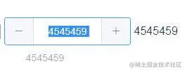

## 具体分析

`@dragstart.prevent` 禁止了div的默认拖动行为。否则会出现这种情况，input中的数字可以拖动


`v-repeat-click="decrease` 自定义指令触发特定逻辑,from`element-ui/src/directives/repeat-click`这个文件

```javascript
 // vnode是Vue的虚拟节点，context是一个Component类型的数据结构。
 // binding.expression就是指令下的方法： 即decrease()
const handler = () => vnode.context[binding.expression].apply();

// 绑定mousedown事件
on(el, 'mousedown', (e) => {
  if (e.button !== 0) return;
  startTime = Date.now();
  once(document, 'mouseup', clear); // 鼠标抬起时销毁这个定时器
  clearInterval(interval); 
  interval = setInterval(handler, 100); // 定时执行handler方法从而每隔0.1s触发一次数字增加或减少事件
});

// 高阶方法
export const once = function(el, event, fn) {
  var listener = function() {
    if (fn) {
      fn.apply(this, arguments);
    }
    off(el, event, listener);
  };
  on(el, event, listener);
};
```

## 参考文章

[1]https://juejin.cn/post/6844903664033726478
[2]https://www.w3xue.com/exp/article/201811/10866.html

